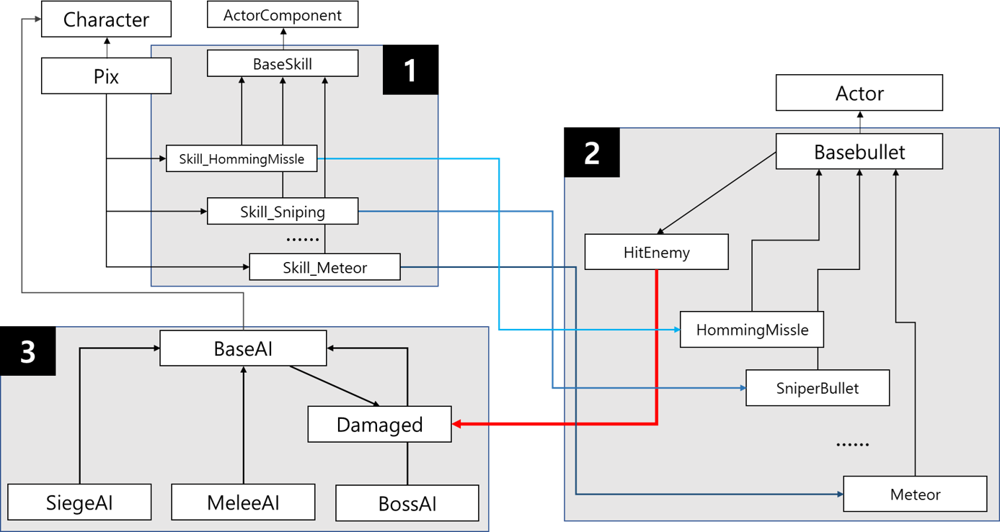

# Dusk
The game for subject that game PX design
# Team
* Team number: 1
* Team name: [이거 해]조
* Team leader: [seungjunpark-khu](https://github.com/seungjunpark-khu)
## Members
* [seungjunpark-khu](https://github.com/seungjunpark-khu) - Gameplay Engineer
* [Jongseo Won](https://github.com/CodeNakWon) - Gameplay/AI Engineer
* [siris-Kang](https://siris-Kang.github.io.) - Gameplay Engineer
* [ssw03270](http://ssw03270.github.io.) - AI Engineer
* [YeBae-Son](https://github.com/YeBae-Son) - UI Engineer
## Results
 * https://www.youtube.com/watch?v=CPXR7sjVgk4    
     
     
   

### Files
 * [Project Files](https://drive.google.com/file/d/1vB7qr8rKHNpvL85vzs7A_FYODgHODal3/view?usp=sharing) - Google Drive
 * [Game Files](https://drive.google.com/file/d/1qgSlx5MMKB61zWNoM7zKf-_BPerrrYtK/view?usp=sharing) - Google Drive

## Contribution - 원종서    
### AI, 스킬 및 데미지 인터페이스 구현
   

> 1. 각 스킬은 ActorComponent를 상속받아 만든 부모 클래스인 BaseSkill의 자식 클래스. 플레이어 캐릭터에 컴포넌트를 붙여서 스킬을 활성화.
> 2. 스킬Component는 고유의 투사체를 생성하는데 부모 클래스인 BaseBullet의 자식클래스. BaseBullet에는 적을 HitEnemy라는 함수가 있는데 적을 타격할 때 호출된다.
> 3. AI의 부모클래스인 BaseAI는 HitEnemy에 의해 호출되는 Damaged 함수가 있으며 이에 의해 피해를 입음. AI가 플레이어에게 데미지를 가할때도 비슷하게 동작. 
 

### 1. AI    

#### 1.1. FSM으로 나타낸 AI 동작(Blackboard + Behavior tree로 구현)   
>    
   
    
#### 1.2. Group AI    
>       
>    
>  01. 플레이어 정보 발견 시 해당 위치를 본인이 속해 있는 GroupAI에 전달
>  02. GroupAI에서 위치 정보를 자신이 관리하는 모든 AI에게 전달
    
     
### 2. Skill    
#### 2.1. Flash     
>   
> 
> 짧은 거리를 순간이동.

#### 2.2. Homing Missile
> 
>
> 적을 추적해 날아가 범위 데미지를 가함

#### 2.3. Reflective Shotgun
> 
>
> 사거리가 짧고 비산각이 큰 산탄   
> 벽에 반사되어 전략적으로 활용가능    
> 전탄명중시 강력한 데미지를 입힐 수 있음

#### 2.4. Distraction Drone
>     
>
> 적의 어그로를 끌어주는 교란스킬

#### 2.5. Meteor
> 
>
> 넓은 범위에 데미지를 주는 스킬    
> 매우 강력하기 때문에 큰 에너지를 소모하고 긴 딜레이 이후 낙하    
> 교란스킬과 연계하면 효과적    

